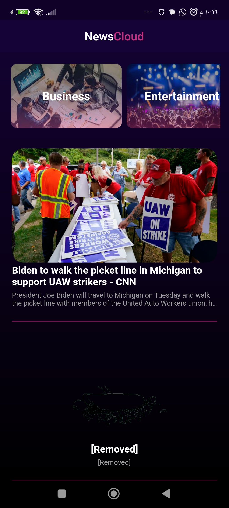
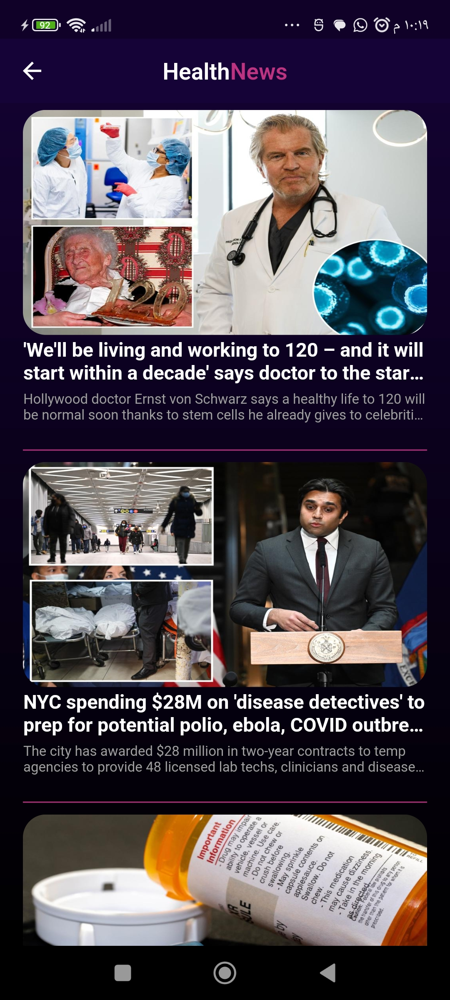
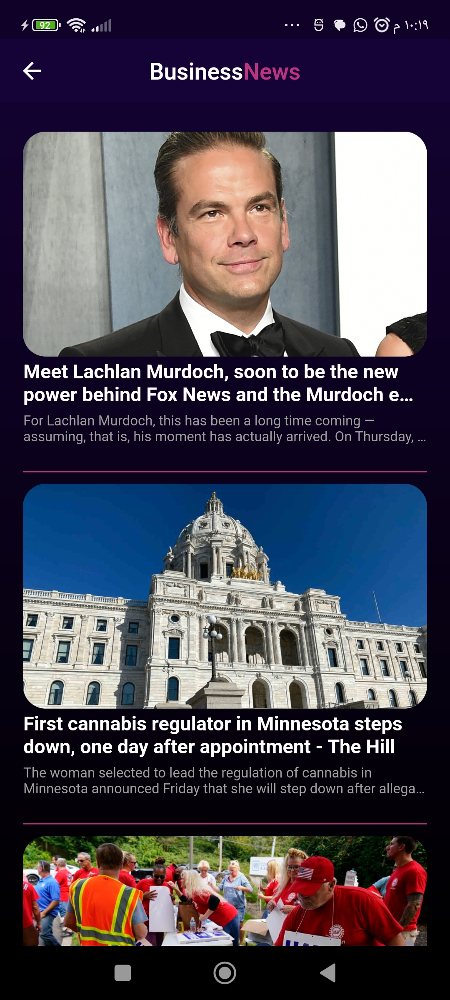

# News App 📰📱🧠

An  Application Was Built Using Flutter Framework. 📦📑

## About The app 🖋️📖  

The package 📦 was used is dio for handling api services (Get The Data From The Internet)   
There are two screens in this app in the 'views' folder 📂  
1) home_view  
2) category_view  

## The Final Result 🧰💪😎 

  

  

  

  

  

  

